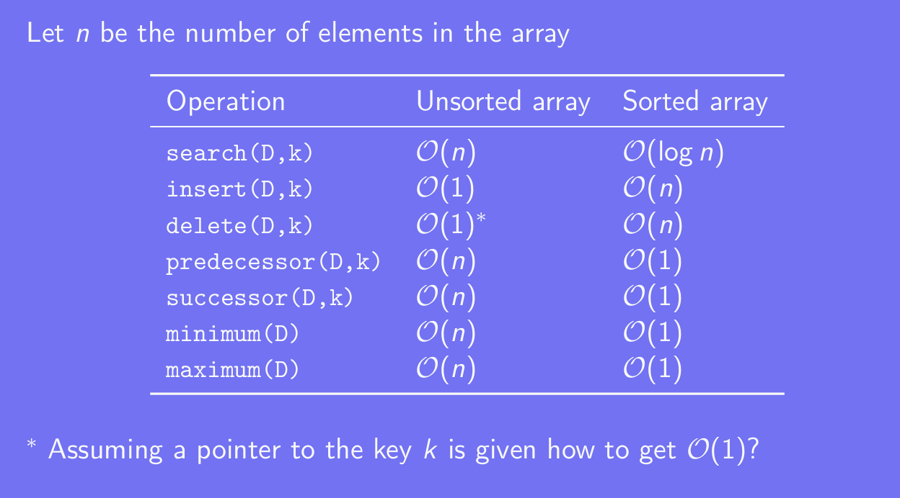
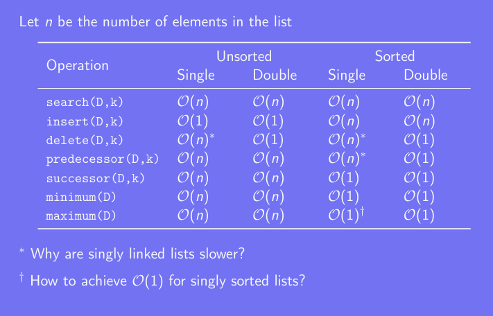
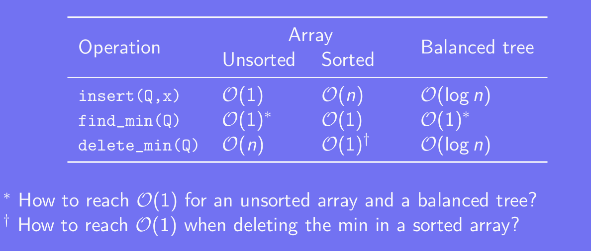

# DATA STRUCTURE

## Dictionary

Support operation below:

Search, Insert, Delete, Max/Min, Predecessor/Successor.

### Implementation

#### Array

Note:
- Binary search for Sorted Array 
- Swap the key k with the last one in the array will have O(1) time delete.

Note:
- Singly Linked List need to maintain the pointer. Find the predecessors need O(n) time but in double linked list, if we have the pointer we dont need to do that.
- Use extra storage for the maximum.

## Priority_queue

Support operation below:

Insert, Find min/max, Delete min/max

Note: 
- Extra storage.
- In the sorted array, we can use desecending order to sort or mark the head of the array.

## How to develop an efficient algorithm

