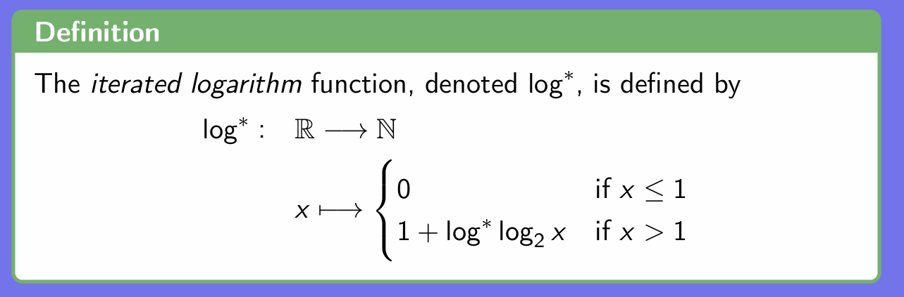
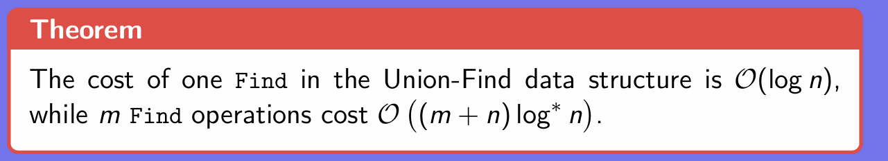
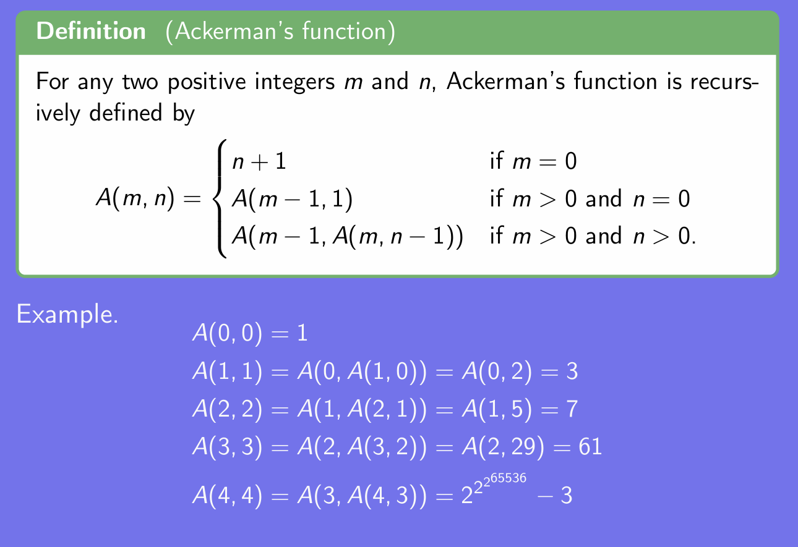
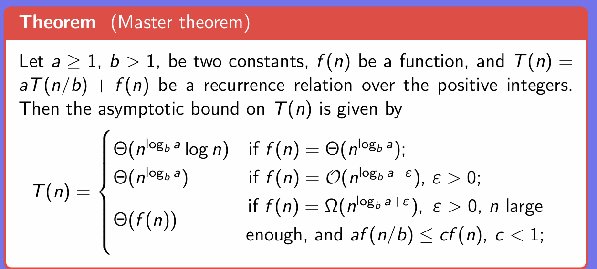
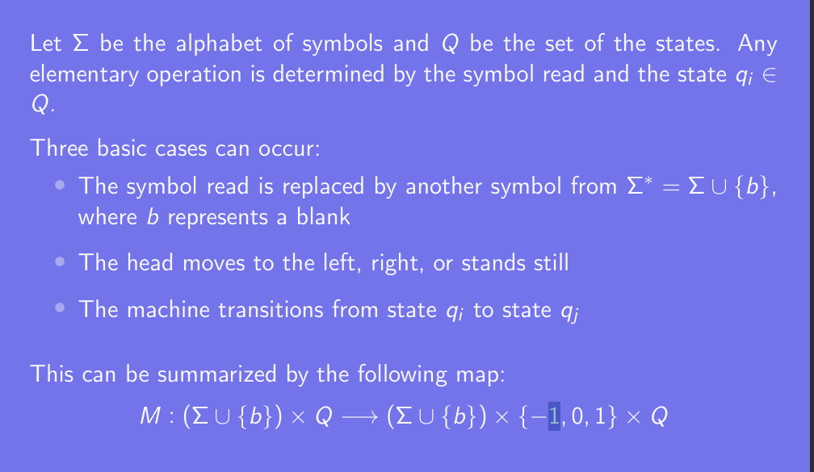
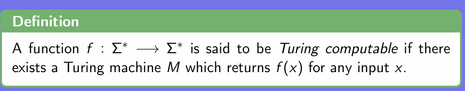
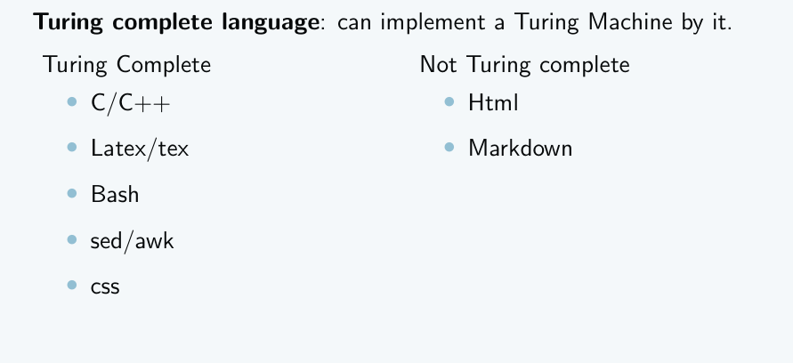
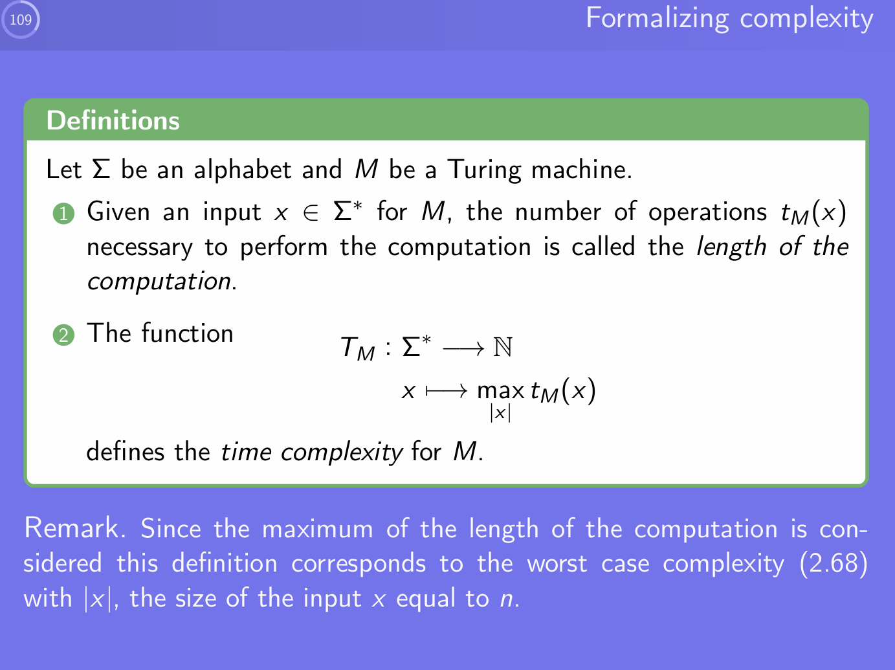
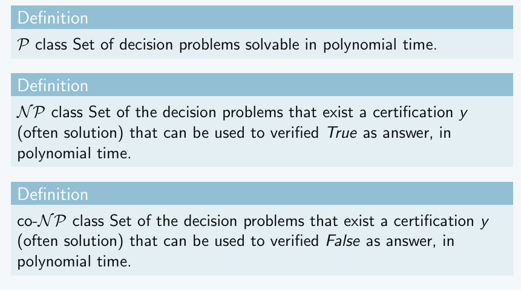
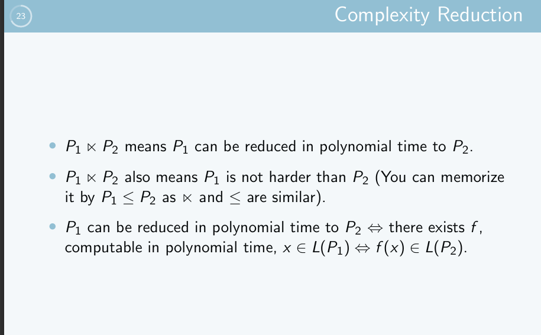

# DATA STRUCTURE

## Dictionary

Support operation below:

Search, Insert, Delete, Max/Min, Predecessor/Successor.

### Implementation

#### Array

Note:
- Binary search for Sorted Array 
- Swap the key k with the last one in the array will have O(1) time delete.

Note:
- Singly Linked List need to maintain the pointer. Find the predecessors need O(n) time but in double linked list, if we have the pointer we dont need to do that.
- Use extra storage for the maximum.

## Priority_queue

Support operation below:

Insert, Find min/max, Delete min/max

Note: 
- Extra storage.
- In the sorted array, we can use desecending order to sort or mark the head of the array.

## How to develop an efficient algorithm

# Complexity Theory

## Running time

Random Access Machine model:

- Each simple operation takes one step.
- loops are composed of several simple steps.
- Each memory access accounts for one step.

Note:
- Gale-Shapley algorithm has complexity $O(n^2)$.

## Master Theorem

## Computational Complexity

### Definitions

1. A computational problem is a qustion or set of questions that a computer might be able to solve.

2. The study of the solutions to computational problems composes the fiels of Algorithms.

3. Computational complexity attempts to classify algorithms depending on their speed or memory usage.

### Taxonomy of computational problems.

1. A decision problem is a computational problem admiiting exactly one of the two answers.(Yes/No)

2. A search problem isa computational problem where the answer is an arbitrary string.

e.g. Let n be an integer, find all the primes less than n.

3. A counting problem is a computational problem where the answer is the number of solutions to a corresponding search problem.

e.g. Let n be an integer, count the number of primes less than n.

4. An optimization problem is an computational problem where the answer is the best solution, which respect to some parameters, to a correspoding search problem.

e.g. For n a non-prime integerm, find the largest prime factor of n.

5. A function problem is a computational problem admitting exactly one answer for every input. The answer is more complex than in the case of a decision problem.

e.g. Given a list of cities and the distance between each pair, find the shortest route passing through all the cities exactly once and returning to the first visited city.

Note:
- Counting problem and optimization problems are closely related to search problem.

- Any optimization problems can be transformed into a decision problem.

- Decision problems play a central role in computability and complexity theories.

## Turing Machine

### Definition 

- It is composed of an infinite tape
- The tape is divided into cells
- Each cell contains a symbol taken from alphabet or a blank
- The tape is read or written, cell by cell, by a head
- At any time the device is in a states $q_i$ with i $\in $ N.

### Elementary operation

### Deterministic computation:

A fixed computation with initial state $q_0$ and a finite sequence of elementary operations.

### Turing computable

### Turing complete Language:

## The RAM model 
### Components
- A control unit: containing a program and a program register pointing to the instruction to be executed.

- An arithmetic unit: execuates all the arithmetic operations.

- A memory: divide into cells, each containing an integer.

- An input unit: an input tape divided into cells and a head which reads the input.

- An output unit: an output tape divided into cells and a head which writes the output.
  
### Initailization of a RAW

- All the cells are set to 0, besides the first n input cells
  
- The program register contains 1
  
- The first n cells contain the value from the n input cells.

### RAW vs Turing machine
Two models are equivalent.

- For every Turing machine M, there exists a program for P for RAW that simulate M.
  
- For a programe P of RAM, there exists a Turing machine M with five tapes such that P and M behave the same.

### Formalizing complexity 

## Brief Review of NP 

### Important conclusion

-  SAT is NP-complete
-  The Halting problem is NP-hard.
-  TQBF can be solved in exponential time and polynomial space.
-  TQBF is PSPACE-complete and in particular it is NP-hard.
-  
# Dynamic Programming

## Idea Behind dynamic programming

1. Overlapping Subproblem (Sum)

2. Optimal Substructure

3. State Transition Equation

4. Boundary Condition

## The Advantage of dynamic programming

1. Dynamic programming save both time and space (Do not waste memory because of recursion)
2. 
## Shortest Paths in weighted graphs

Consider two cases:

1. graphs only has edges with positive labels.  Using dijkstra

2. It has edges with positive and negative labels. Using Bellman-Ford.

**Proposition**

If G is a graph with no negative cycle, then there is a shortest simple path going from a source vertex s to a target vertex t.

**Theorem**

Bellman-Ford algorithm is correct and runs in time O(mn) on a graph composed of n vertices and m edges.

## Edit distance problem

**Problem (Edit distance)**

